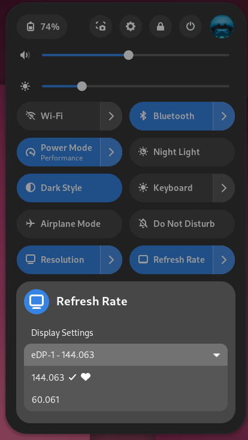

# Resolution and Refresh Rate in GNOME Quick Settings

GNOME Shell extension to add Resolution and Refresh Rate toggle menu to Quick Settings.

## Install
The extension is available on [Resolution and Refresh Rate in Quick Settings](https://extensions.gnome.org/extension/7183/resolution-and-refresh-rate-in-quick-settings/) page

## Translations
You can help the project with translating strings into your language [on Crowdin](https://crowdin.com/project/quick-settings-resolution-and-refresh-rate)

## Useful info

### How to add custom refresh rate for your display on Wayland using GRUB
Follow [this guide](https://davejansen.com/add-custom-resolution-and-refresh-rate-when-using-wayland-gnome/)

## Report Issues
In the [Issues](https://github.com/rukins/quick-settings-resolution-and-refresh-rate/issues) section you can suggest any improvements and report any bugs you find

## Contributing
This is an open-source project and all contributions are highly welcomed

## License
Released under [MIT License](LICENSE)
